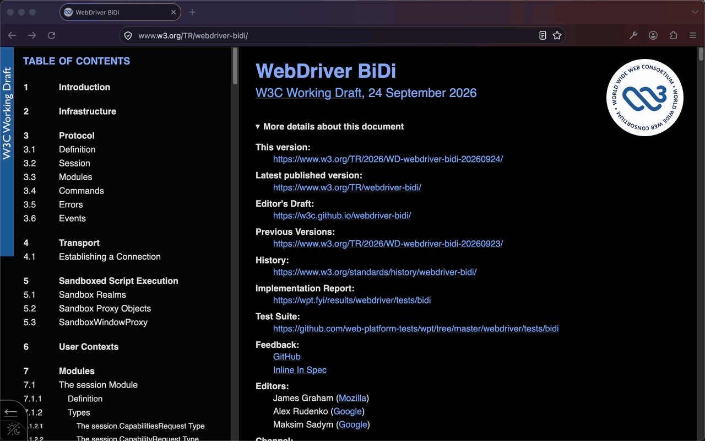

# Firefox Agent Bridge

Browser tools for Claude Code that drive Firefox Developer Edition the way Claude in Chrome
drives Chrome, running on your Claude subscription through Claude Code.

Unofficial. Not affiliated with Anthropic or Mozilla.



- Tabs live in a per-session **Claude** tab group and stay in the background. Nothing takes
  focus, and the OS cursor never moves. Tabs a page opens (`target=_blank`, `window.open`)
  join the group, focus is handed back to your tab, and the click result names the new tab.
- Clicks and keys are **trusted** (`isTrusted: true`, with user activation), including inside
  cross-origin iframes.
- A cursor shows where Claude is pointing and clicking, with a ripple on each click. It's
  drawn as anonymous content, so the page can't see it or hit it, and it's hidden while
  screenshots are taken.
- Page scripts run without being blocked by the page's CSP. File inputs are filled directly,
  without opening a native picker.

## How it works

```
Claude Code ──stdio MCP──▶ mcp/server.mjs ──unix socket──▶ host/host.mjs ──native messaging──▶ extension
                                                                                                 │
                                          background.js (tools, tab groups, screenshots) ◀───────┘
                                                   │ browser.claudePage (experiment API, parent process)
                                                   ▼
                                    ClaudePage JSWindowActor (content process, every frame)
```

Firefox extensions have no `chrome.debugger`, so ordinary extension code can only dispatch
untrusted events. This extension ships a **WebExtension Experiment**: privileged code that
Developer Edition can load when signatures are off. It registers a JSWindowActor. The actor
creates events in chrome code and dispatches them through the pres shell
(`windowUtils.dispatchDOMEventViaPresShellForTesting`), and it types with
`nsITextInputProcessor`. The page therefore receives the events as real input.

Other details:

- **Actor modules.** Content processes can't read `~/Code`, so the actor modules are copied into
  `<profile>/chrome/firefox-agent-bridge/` at startup and served from a `resource://` alias.
- **Background tabs.** Normally hidden tabs don't render and IntersectionObserver never fires,
  so lazy lists stay empty. Session tabs are therefore marked active (`docShellIsActive`)
  without being shown.
- **Screenshots.** `tabs.captureTab` works on background tabs. Images are scaled to at most
  1568px on the long edge and 1.15 MP. Coordinates are mapped back to CSS pixels.

## Tools

These have the same names and arguments as Claude in Chrome: `tabs_context_mcp`,
`tabs_create_mcp`, `tabs_close_mcp`, `navigate`, `computer`, `read_page`, `find`,
`form_input`, `javascript_tool`, `file_upload` and `get_page_text`. In Claude Code they show up
as `mcp__firefox__<name>`.

Differences from Chrome:

- `find` matches keywords over element names, roles, labels and attributes. It doesn't call a
  model, so use words that appear on the page.
- `read_page` and `find` only walk the top frame. Clicks and typing by coordinate reach into any
  frame.
- There is no `gif_creator`, console reading, network reading or shortcuts.

## Security

- Signature checks are off for the whole profile, so use a separate Developer Edition profile.
- Anything running as your user can reach `~/.firefox-agent-bridge/bridge.sock` (mode 0600) and
  drive the browser with your logins.
- `javascript_tool` runs in the page and ignores its CSP.

## Install

Requires macOS, Firefox Developer Edition 140+, Node and Claude Code.

1. Quit Firefox Developer Edition.
2. Run `scripts/install.sh [profile-dir]`. With no argument, it picks the Developer Edition
   default profile.
3. Start Firefox Developer Edition, then start a new Claude Code session.

The install script:

- writes the native host manifest to `~/Library/Application Support/Mozilla/NativeMessagingHosts/firefox_agent_bridge.json`
- writes a proxy file at `<profile>/extensions/firefox-agent-bridge@local` that points at `extension/`
- adds `xpinstall.signatures.required=false`, `extensions.experiments.enabled=true` and
  `extensions.autoDisableScopes=14` to `user.js`
- runs `claude mcp add --scope user firefox`

## Development

- Edit the files under `extension/`, then run `scripts/restart-firefox.sh`, which restarts Firefox with `-purgecaches`. Firefox caches
  the experiment schema, and content processes cache the actor modules.
- Test a single tool without a Claude session:
  `node scripts/ffctl.mjs navigate '{"url":"example.com"}' my-session`
- Logs are in `~/.firefox-agent-bridge/host.log`. Screenshots saved with `save_to_disk` go to
  `~/.firefox-agent-bridge/screenshots/`.

## Caveats

- This only works in Developer Edition (or Nightly). Release Firefox won't load unsigned
  experiments.
- It relies on internal Firefox APIs: JSWindowActors, the pres-shell dispatch helper and
  nsITextInputProcessor. A Developer Edition update could break it. If one does, check
  `host.log` and the Browser Console first.
- Sessions don't survive a browser restart. Claude tab groups that session restore brings back
  are kept, renamed "Claude (earlier)" and greyed out, so staged work survives; close them when done.

## License

[MPL-2.0](LICENSE)
