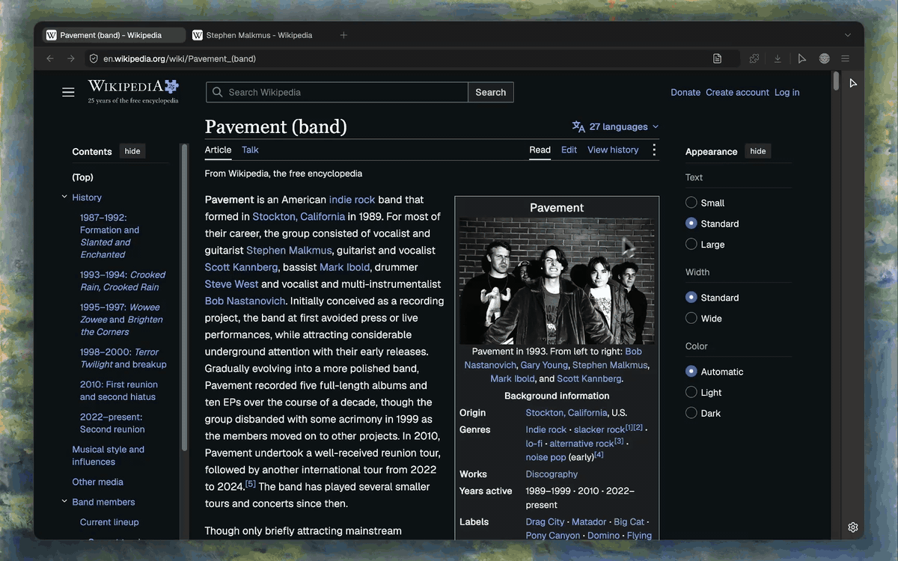

# Firefox Agent Bridge

Browser tools that let MCP clients (Claude Code, the Codex CLI and app, the Claude desktop app)
drive Firefox Developer Edition the way Claude in Chrome drives Chrome, plus a sidebar chat that
runs Claude Code or Codex right in Firefox, all on your existing agent subscription.

Unofficial. Not affiliated with Anthropic, OpenAI or Mozilla.



- A [chat panel](#chat-panel) in Firefox's sidebar: click the toolbar button, ask, and the agent
  works in the tab you're on. Drag more tabs into its group and it sees those too. Tasks can also
  start from the [address bar](#address-bar) or [your phone](#start-a-task-from-your-phone), you
  can [point at elements](#point-and-ask) or [teach it a task](#teach) by doing it, and for
  several pages it can [fan out](#fan-out) to one sub-agent per tab.
- Tabs live in a per-session tab group named after the client (**Claude**, **Codex**, ...; a
  second session from the same client gets "Codex 2") and stay in the background. Every agent
  group is grey, with a [state icon](#tab-group-icons) in its label. Nothing takes
  focus, and the OS cursor never moves. Tabs a page opens (`target=_blank`, `window.open`)
  join the group, focus is handed back to your tab, and the click result names the new tab.
- Clicks and keys are **trusted** (`isTrusted: true`, with user activation), including inside
  cross-origin iframes.
- A cursor shows where the agent is pointing and clicking, with a ripple on each click. It's
  drawn as anonymous content, so the page can't see it or hit it, and it's hidden while
  screenshots are taken.
- Page scripts run without being blocked by the page's CSP. File inputs are filled directly,
  without opening a native picker.
- Password, card and one-time-code fields are [redacted](#redaction) before a screenshot or page
  read leaves Firefox. The agent can still fill them.

## How it works

```
sidebar chat ──native messaging──▶ host/host.mjs ──spawns──▶ claude -p / codex exec (an MCP client, below)

MCP client ──stdio MCP──▶ mcp/server.mjs ──unix socket──▶ host/host.mjs ──native messaging──▶ extension
                                                                                                 │
                                          background.js (tools, tab groups, screenshots) ◀───────┘
                                                   │ browser.claudePage (experiment API, parent process)
                                                   ▼
                                    ClaudePage JSWindowActor (content process, every frame)
```

Firefox extensions have no `chrome.debugger`, so ordinary extension code can only dispatch
untrusted events. This extension ships a **WebExtension Experiment**: privileged code that
Developer Edition can load when signatures are off. It registers a JSWindowActor. The actor
creates events in chrome code and dispatches them through the pres shell
(`windowUtils.dispatchDOMEventViaPresShellForTesting`), and it types with
`nsITextInputProcessor`. The page therefore receives the events as real input.

Other details:

- **Actor modules.** Content processes can't read `~/Code`, so the actor modules are copied into
  `<profile>/chrome/firefox-agent-bridge/` at startup and served from a `resource://` alias.
- **Background tabs.** Normally hidden tabs don't render and IntersectionObserver never fires,
  so lazy lists stay empty. Session tabs are therefore marked active (`docShellIsActive`)
  without being shown.
- **Window on another Space.** When Firefox's window is occluded (on another macOS Space,
  covered or minimized), Firefox stops giving its pages animation frames, session tabs included,
  so lazy lists, IntersectionObserver content and canvas apps would stall. While a connected
  session has tabs in a window, that window is kept rendering (`forceAppWindowActive`, the switch
  Picture-in-Picture uses to keep captions updating), and let go when the session disconnects or
  its tabs leave. There's no per-tab switch, so the tab you left showing in that window keeps
  rendering too, which costs some battery while it's out of sight.
- **Screenshots.** `tabs.captureTab` works on background tabs. Images are scaled to at most
  1568px on the long edge and 1.15 MP. Coordinates are mapped back to CSS pixels, with the tab's
  zoom taken out. If the page reports a 0x0 viewport (seen while the window was occluded), the
  size comes from the tab, or else from the captured image.

## Tools

These have the same names and arguments as Claude in Chrome: `tabs_context_mcp`,
`tabs_create_mcp`, `tabs_close_mcp`, `navigate`, `computer`, `read_page`, `find`,
`form_input`, `javascript_tool`, `file_upload` and `get_page_text`. In Claude Code they show up
as `mcp__firefox__<name>`; Codex lists them under `mcp__firefox`.

`replay_steps {path, inputs, tabId}` is this bridge's own: it runs a `replay.json` saved by
[Teach](#teach) step by step without the model, and at the first step that doesn't match it
stops and returns the step, what was expected, the recorded screenshot of it and the page's
interactive elements, so the agent finishes from there.

Differences from Chrome:

- `find` matches keywords over element names, roles, labels and attributes. It doesn't call a
  model, so use words that appear on the page.
- `read_page` and `find` walk child frames too, cross-origin ones and ones inside shadow roots
  included: a frame's tree goes under its iframe's line, and `find` gives a frame's matches
  coordinates in the top frame's screenshot. A ref from a child frame names its frame, as in
  `ref_7@f12`, and works with every tool that takes a ref. Clicks and scrolling by coordinate
  reach into any frame; a scroll over a frame that can't scroll scrolls the page around it.
  Typing and keys go to the frame the last click landed in, and their result names the element
  that got them and its value.
- There is no `gif_creator`, console reading, network reading or shortcuts.

## Chat panel

The toolbar button opens a chat in Firefox's sidebar, like Claude in Chrome's side panel. Press
the button again to close it. It runs an agent on your own plan, either **Claude Code** (`claude -p`)
or **Codex** (`codex exec`), and gives it the same Firefox tools as a terminal session.
Nothing is billed beyond your existing subscription, and nothing runs until you send a message.

- **Tabs.** The first message puts the tab you're viewing into a new tab group ("Claude", "Codex",
  ...) and the agent works in that group. Add tabs with the composer's + menu or by dragging them
  into the group; each message tells the agent which tabs are in it. If the viewed tab is pinned or
  already belongs to another chat, the chat starts with a blank tab instead.
- **Composer.** The + menu attaches files or photos (paste and drop work too), adds a tab, lists
  your connectors and plugins, and lists your [skills](#skills). The model menu picks the engine,
  model and effort. Enter sends; while a task runs, Stop interrupts it, and a message you
  send instead is added to the task.
- **Permissions.** Firefox tools run without asking. Anything else, such as a shell command, a file
  edit, a read outside the chat folder or a web fetch, shows an Allow once / Always allow in this
  chat / Deny card with what it would do, and waits. Always allow covers the exact command (or the
  prefix Claude Code suggests, never a chained command), the exact file, or a connector tool, not
  more. If the sidebar is closed while a card waits, the toolbar button shows a `!`. Codex chats
  run in a read-only sandbox, since `codex exec` can't ask; it can still read files, so it is the
  less contained engine.
- **History.** The clock button lists recent tasks: chats from the panel, and Claude Code sessions
  from your terminal that used the Firefox tools in the last 14 days. Opening one loads its
  transcript and the next message resumes it. Claude Code chats are ordinary sessions in
  `~/.claude/projects/` (their working folder is `~/.firefox-agent-bridge/chat/`), and the panel
  keeps only its own index in `~/.firefox-agent-bridge/chat/chats.json`; Codex chats are kept in
  Codex's own history. Attachments go to `~/.firefox-agent-bridge/chat/uploads/`.
- **Errors.** A usage limit, a missing sign-in and a missing `claude` or `codex` binary each show
  a banner. The host finds the binaries from `CLAUDE_BIN` / `CODEX_BIN` (baked into its launcher
  by `scripts/install.sh`), then common install paths and your login shell.

The panel's protocol and the host's process handling are described in
[docs/chat-panel.md](docs/chat-panel.md). Connector toggles and voice input aren't built.

### Skills

Typing `/` at the start of the composer opens a menu of your skills (Codex's own skills when Codex
is the engine). Skills for the site you're on come first: those whose `sites:` frontmatter names
it (`sites: linkedin.com, greenhouse.io`), or, with no `sites:`, whose name or description
mentions the site's main label. Arrow keys and Enter or Tab pick one, Esc closes; the + menu's
skills list picks one too. The pick becomes a chip in the composer and in your message, and
sending runs it on the current tab: Claude Code gets `/skill-name <your text>`, Codex is told to
read the skill's file. The steps card shows "Loaded skill <name>".

### Point and ask

While the panel is open, hold Alt (⌥ on a Mac) over the page you're viewing: the element under
the pointer gets an outline and a label with its role and name. Alt+click attaches it to the
composer instead of clicking it: a crop of the element (with [masked fields](#redaction)
covered), plus its role, name, visible text (masked like any page read) and a ref the agent can use with `computer`,
`read_page`, `find` and `form_input`. The tab joins the chat's group if it isn't in it. Esc or
letting go of Alt clears the outline.

The agent points back by linking an element as `[label](ref:ref_12)`, which shows as a purple
chip; hovering it outlines the element in its tab, and clicking it switches to the tab and
scrolls the element into view. Both directions work inside frames.

### Agent cam

While a task runs, the steps card shows a live thumbnail of the tab the agent last acted on, with
its cursor, refreshed about twice a second; the button in its corner switches to that tab. It
pauses while the panel is hidden or the card is scrolled out of view, and goes away when the task
ends. The thumbnail stays in the sidebar and never reaches the agent, so it isn't redacted.

### Teach

**Teach Claude a task** in the + menu records you doing a task in the tab you're on (it isn't
grouped): each click, field you type in, select and Enter is a step, found again later by its role
and accessible name, with a CSS selector and nearby text as fallbacks, and a small screenshot
(with [masked fields](#redaction) covered). Values typed into password and other secret fields,
and fields the redaction rules mask, are never recorded; the step says "from Keychain" or "ask". Stop and draft sends the steps to the
chat's engine, which drafts a skill: name, trigger, inputs (the typed values that change between
runs), checks. Save writes `~/.claude/skills/<name>/SKILL.md` and `replay.json` (Codex:
`~/.codex/skills/`); with "Replay without Claude when steps match" on, the skill runs
[`replay_steps`](#tools) first. Try it once runs the draft in a tab of the agent's own. The
formats are in [docs/teach.md](docs/teach.md).

### Address bar

Type `c` and a space, then a task: Enter starts it in a new tab group (with the engine, model and
effort the panel last used) without opening the sidebar or leaving your tab. "Ask about this page"
starts it with the viewed tab in the group, and the two most recent chats are offered to resume in
the sidebar. The group label shows Working and Done as usual; if the task finishes while you're
elsewhere, one notification ("Claude 2 finished" and the first line of the reply) takes you to the
group when clicked.

### Fan-out

For a task that needs the same facts from 4 or more independent pages ("compare these six
desks on price, depth and warranty"), a Claude Code chat can start one sub-agent per page, each
in its own background tab in the chat's group, and merge their replies into one table. Codex has
no sub-agents, so its chats don't fan out.

- **Steps card.** It shows one row per sub-agent: favicon, site, what it's doing now (or how many
  calls it made), and a status mark, under a "Fanned out to 6 tabs · 4 of 6 done" header. Click a
  row to see that sub-agent's own steps. When a sub-agent finishes, what it returned shows under
  its row, so the answer fills in row by row before the agent writes it up. The
  [agent cam](#agent-cam) is off while sub-agents run, since they work in several tabs at once.
- **Guidance, not a default.** The chat's system prompt asks for fan-out only at 4 or more pages
  (below that, one tab read page by page is about as fast), at most 5 sub-agents at a time, each on
  a cheaper model where the Task tool takes one. Each sub-agent is told the exact URL and fields,
  to open its own tab with `tabs_create_mcp` without listing tabs first, to read just those fields
  with `find` or a targeted `javascript_tool` read (falling back to `get_page_text` when a selector
  comes back null), to close its tab, and to reply with only the values. The
  [speed eval](#speed-eval) found it faster but about 2.75x the cost, hence the threshold.
- **Tabs.** Sub-agents share the chat's MCP connection, so their tabs land in its group. Tabs
  opened at the same moment by a session with no group yet join one new group, not one each.
- **History.** A reloaded chat shows each sub-agent's description and reply but not its calls,
  which Claude Code keeps outside the main session file.

## Tab group icons

Each agent group's label shows what its session is doing, as a small static icon left of the
title. Marks take the label's text color, so they follow the theme and work in expanded and
collapsed groups; only Working is purple, the agent cursor's color.

| Icon | State |
| --- | --- |
| Outline pointer | Idle: a client is connected and nothing is running |
| Solid purple pointer | Working: a call is running or ended in the last few seconds |
| Ring with a dot | Needs you: a chat is waiting on a permission prompt |
| Pause bars | Paused by Stop |
| Check | Done: a chat turn finished and you haven't looked since (activated a tab in the group, or had that chat showing in an open panel) |
| Ring with a slash | Disconnected: the session has no live client (the MCP client exited, or was disconnected or blocked); a chat counts as connected while it exists |
| Dotted ring | Earlier: a group left by a previous Firefox run |

Firefox's tab group API only has a title, color and collapsed flag, so the icon is drawn by the
experiment: it adds a stylesheet (`extension/experiment/group-state.css`) to every browser
window and sets a `fab-state` attribute on the group's `<tab-group>` element. If it can't find
the label element (a Firefox update changed it), the extension puts a glyph in front of the
title instead: `●` working, `◉` needs you, `○` paused, `✓` done, `⊖` disconnected, `◌` earlier,
and nothing for idle. With the collapsed vertical-tabs sidebar, which shows only a label's first
letter, no icon is drawn.

## Start a task from your phone

Claude Code's Remote Control lets the Claude app on your phone start sessions that run on your
Mac. Because `install.sh` registers the `firefox` MCP server at user scope, those sessions get the
Firefox tools like any other. `scripts/remote-control.sh` keeps that running in the background:

```sh
scripts/remote-control.sh --install                      # start now and at every login
scripts/remote-control.sh --install --permission-mode acceptEdits
scripts/remote-control.sh --status
scripts/remote-control.sh --uninstall
```

It installs a launchd agent (macOS) or a systemd user service (Linux) that runs
`claude remote-control --name Firefox` in `~/.firefox-agent-bridge/chat/`, the sidebar chat's
folder, and logs to `~/.firefox-agent-bridge/remote-control.log`. It finds `claude` the way the
host does (`CLAUDE_BIN`, `PATH`, then the path `install.sh` recorded). Then open the Claude app,
pick the "Firefox" machine in the Code tab and start a task.

- **The Mac must be awake** and logged in, and **Firefox Developer Edition must be open**; the
  tools have nothing to drive otherwise.
- **Permission prompts go to your phone.** Firefox tools run without asking, but anything else
  (a shell command, a file edit) asks there. `--permission-mode` sets a looser mode for these
  sessions instead; without it they use Claude Code's default.
- **They show up in the sidebar's history.** A phone-started session is an ordinary Claude Code
  session that used the Firefox tools, so the clock button lists it, marked "From phone", and you
  can open it and continue in the panel. This mark comes from the session file's `bridge-session`
  entry, so it is only shown for sessions in the chat folder.

## Safety controls

The toolbar button opens the chat panel, and the panel's **⋯** menu holds the controls. Calls
run without a consent prompt, and switching to a session's tab doesn't pause it; you see every
client and call, and Stop or Disconnect cuts them off.

- **Toolbar icon.** A pointer shaped like the agent cursor. It's an outline when idle, turns the
  cursor's purple while an agent is acting or acted in the last few seconds, and gets two pause
  bars when sessions are paused. The sidebar's icon is the same pointer, solid only while an agent
  is acting, and the panel's header says Working, Paused or Needs approval.
- **Stop.** **Stop all agents** in the panel's ⋯ menu, or **Alt+Shift+X** from anywhere in Firefox
  (rebind it in about:addons), pauses every session and interrupts the chat turn that is running. Running calls are answered at
  once, and sessions that haven't started yet start paused. The panel then offers Resume (which
  resumes all sessions, and typing a message resumes too) and End task; **Agents and activity** in
  the ⋯ menu can also resume one session at a time. Stop doesn't undo
  work already under way: a click or page load that has started still finishes, but its result is
  dropped. Paused groups show the pause icon. The Stop button in the composer is
  different: it interrupts only the running chat turn.
- **Clients.** Each client connecting to the socket announces a name, version, pid and working
  directory, and its calls run right away. **Agents and activity** lists each session with its
  client; open a row to see the version, pid, folder, when it connected and how many calls it
  made. The name is self-reported, so check the pid and folder. **Disconnect** (in the opened row)
  closes that connection, stops its calls in progress and blocks the name: calls from any client
  using it, reconnects included, fail at once until you click **Unblock** or restart Firefox. The panel's own agent shows up as `claude-code (sidebar)` or `codex (sidebar)`, so blocking a terminal session of the same program leaves it alone.
- **Activity log.** Under Activity, the same view lists the last 100 of up to 500 calls: time,
  session, client, tool, action, tab, page origin, outcome and duration. It can be filtered by
  session, copied as JSON, or cleared, and it is lost when Firefox restarts. It never records
  typed text, key sequences, form values, script source, find queries, file paths or full URLs,
  only their length or count. Error messages have those values cut out, and script errors keep only
  the error type.

Paused and blocked calls fail with a message telling the agent to ask you, not to retry.

## Redaction

Sensitive fields are masked in what the agent sees and reads, before it leaves Firefox:

- **Screenshots.** Before `computer` takes a screenshot or zoom (and before the crop of a
  [pointed-at](#point-and-ask) element or a [Teach](#teach) step's screenshot), every frame of the tab, including
  cross-origin iframes such as a payment provider's card fields, covers each sensitive field with
  a solid bar labeled with what it is and whether it's filled ("card number · filled"). The bars
  are drawn as anonymous content, like the cursor, so the page can't see or remove them, and
  they're removed right after the capture. If a frame can't draw its bars, the screenshot fails
  instead of going out unmasked.
- **Text.** `read_page`, `find`, `get_page_text` and the read-back from `form_input` show
  `[redacted: <kind>, filled|empty]` in place of the value, e.g. `value=[redacted: cc-number, filled]`.
  Page text marks a field after its label. A field's value (4 characters or more) is also masked
  where the page repeats it elsewhere, and `find` never matches a masked value.
- **Filling works.** `form_input` and typing into a masked field are allowed; only reading the value
  back is blocked.
- Each result that masked something ends with a line such as `3 fields masked on acme-supply.com`,
  which the sidebar shows under the steps as a note with a lock.

Sensitive means an input of type `password`, a field whose `autocomplete` is a `cc-*` token,
`one-time-code`, `new-password` or `current-password`, and anything a per-site CSS selector
matches (with its text, for elements that aren't fields). The rules live in
`~/.firefox-agent-bridge/redact.json`, written with the defaults the first time the host runs:

```json
{
  "always": ["password", "cc-*", "one-time-code", "new-password", "current-password"],
  "sites": { "chase.com": [".account-number"] }
}
```

`always` lists input types and autocomplete tokens (a trailing `*` matches a prefix). A site key
covers its subdomains. The host rereads the file when it changes, so edits apply to the next call;
if it can't be parsed, the defaults apply.

Limits:

- `javascript_tool` can still read field values. A masked field's current value is cut out of the
  script's result, but a script can return it transformed (split, reversed, encoded) and get it out.
- Masking follows the rules, not the meaning: a card number typed into a field without
  `autocomplete="cc-number"`, or shown as plain text, isn't masked unless a site rule covers it.
- `get_page_text` only reads the top frame. `read_page` and `find` read every frame with the
  rules for that frame's own site; screenshots cover iframes as described above.

## Security

- Signature checks are off for the whole profile, so use a separate Developer Edition profile.
- `~/.firefox-agent-bridge/bridge.sock` is mode 0600 in a 0700 directory, so only processes
  running as your user can connect. Any of them can drive the browser; Agents and activity in the
  panel shows who is connected and what they did, and Stop and Disconnect cut them off.
- There is no shared-secret token on the socket. Any process that can reach the socket runs as
  your user and could read a token file just as easily, so a token would add nothing. Names are
  self-reported, so a blocked name can be dodged by another program running as you.
- `javascript_tool` runs in the page and ignores its CSP, and it can read the values
  [redaction](#redaction) masks elsewhere.

## Install

Requires macOS or Linux, Firefox Developer Edition 140+, Node, and an MCP client.

1. Quit Firefox Developer Edition.
2. Run `scripts/install.sh [options] [profile-dir]`. With no profile dir, it picks the Developer
   Edition default profile, looking in `~/Library/Application Support/Firefox` on macOS and in
   `~/.config/mozilla/firefox` (Firefox 147+) and `~/.mozilla/firefox` on Linux.
   - `--claude-code` registers with Claude Code. This is the default when no client is named.
   - `--codex` registers with Codex; the CLI and the app share `~/.codex/config.toml`.
   - `--claude-desktop` registers with the Claude desktop app.
   - `--all` registers with every one of these that is installed.
   - `--no-clients` only installs into Firefox; `--clients-only` only registers clients.
   - `--help` lists them. Re-running is safe.
3. Start Firefox Developer Edition, then start a new session in your MCP client (restart the
   Claude desktop app).

The install script:

- writes the native host manifest to `~/Library/Application Support/Mozilla/NativeMessagingHosts/`
  (macOS) or `~/.mozilla/native-messaging-hosts/` (Linux), with a launcher that pins your node
- writes a proxy file at `<profile>/extensions/firefox-agent-bridge@local` that points at `extension/`
- adds `xpinstall.signatures.required=false`, `extensions.experiments.enabled=true` and
  `extensions.autoDisableScopes=14` to `user.js`
- registers the `firefox` MCP server with the selected clients (`claude mcp add --scope user`,
  `codex mcp add` or `~/.codex/config.toml`, `claude_desktop_config.json`), keeping a `.bak` of
  any config file it rewrites

### Codex tool approval

Codex asks before each MCP tool call. With `approval_policy = "never"` it refuses them instead,
so every browser call fails. To let this server's tools run, add to `~/.codex/config.toml`:

```toml
[mcp_servers.firefox]
default_tools_approval_mode = "approve"
```

### Using it with Codex without a ChatGPT subscription

Codex can run on either of these instead:

- **An OpenAI API key**, billed per use: `printenv OPENAI_API_KEY | codex login --with-api-key`.
- **A local model**: start Ollama or LM Studio with a model, then run
  `codex --oss --local-provider ollama` (or `lmstudio`), adding `-m <model>` to pick one. Small
  local models are much weaker at multi-step browser tasks than hosted ones.

## Development

- Edit the files under `extension/`, then run `scripts/restart-firefox.sh`, which restarts
  Firefox with `-purgecaches` and waits for the bridge. Firefox caches the experiment schema, and
  content processes cache the actor modules. On Linux it looks for `firefox-developer-edition`
  or `firefox-devedition` on PATH, `~/firefox/firefox` and `/opt/firefox-developer-edition`; set
  `FIREFOX_BIN=/path/to/firefox` otherwise.
- Test a single tool without an agent session:
  `node scripts/ffctl.mjs navigate '{"url":"example.com"}' my-session`
- Tests:
  - `node --test extension/test/*.test.js` runs the extension's policy and wiring tests against
    a mocked `browser`.
  - `node --test host/test/*.test.mjs` runs the chat host against fake `claude` and `codex`
    executables, the summary and error formatting, and the host's native-messaging wiring.
  - `node scripts/test-bridge.mjs` starts the native host and plays the extension's side
    against the MCP server, `ffctl` and raw socket clients.
  - `FIREFOX_BIN=/path/to/firefox node scripts/test-firefox.mjs` runs the whole stack in a real
    Firefox (Linux, needs Xvfb). It installs into a fresh profile under a temp HOME and drives a
    local test page and the popup through `mcp/server.mjs`.
  - `FIREFOX_BIN=/path/to/firefox CODEX_BIN=/path/to/codex node scripts/test-codex.mjs` does the
    same with the Codex CLI as the client, driven by a scripted fake model, so it needs no
    OpenAI account.
  - The last two save screenshots to `SHOTS_DIR` (default `<tmpdir>/firefox-agent-bridge-shots`);
    `KEEP=1` keeps their temp dir.
- Logs are in `~/.firefox-agent-bridge/host.log`. Screenshots saved with `save_to_disk` go to
  `~/.firefox-agent-bridge/screenshots/`.

## Speed eval

`eval/` holds a harness that tested four speed ideas against today's tools before building any
of them (tasks, arms and how to run it in [eval/README.md](eval/README.md); results in
[eval/results/report.md](eval/results/report.md)). Only [fan-out](#fan-out) was built:

- **Fan-out: built, as guidance.** It cut median wall time on both five-page compare tasks (PyPI
  27.8s to 22.9s, -18%; npm 31.6s to 18.7s, -41%) with 6/6 success, but cost about 2.75x ($0.068
  to $0.188 a run) and about 3x the input tokens. So the prompt asks for it only at 4 or more
  pages, with targeted reads in the sub-agents, and it isn't the default.
- **Strip (reader-view extraction): skipped.** On the 3 eval articles it raised tokens (1.08x
  input, 2.2x output), since they had almost no page chrome to strip. In a 22-URL probe the
  savings came with lost paragraphs on 6 URLs (BBC kept 0.33 of them, Wired 0.50), and Wikipedia
  errored.
- **Data (re-fetching the page's JSON): skipped.** Success fell to 8/9: one Hacker News run
  re-queried the Algolia API with different defaults and confidently answered 62 against the true
  41. Tool-call savings weren't consistent (crates -1, HN 0, Ashby +4).
- **Accessibility tree: inconclusive, not built.** The probe estimates `read_page` misses about 2%
  of interactive elements, but it undercounts payment and captcha fields: a cross-origin frame's
  URL opened on its own renders nothing for Stripe card fields and hCaptcha. No real accessibility
  tree was compared.

There were no infrastructure failures or flaky-task confounds in the eval runs.

## Caveats

- This only works in Developer Edition (or Nightly). Release Firefox won't load unsigned
  experiments.
- It relies on internal Firefox APIs: JSWindowActors, the pres-shell dispatch helper and
  nsITextInputProcessor. A Developer Edition update could break it. If one does, check
  `host.log` and the Browser Console first.
- Sessions don't survive a browser restart. Session tab groups that session restore brings back
  are kept, given the Earlier icon and greyed out, so staged work survives; close them when done.
  A group of your own with exactly the title of a label the extension has used (e.g. "Codex") is
  treated the same way. Groups named by earlier versions ("Codex (earlier)", "Codex (paused)")
  are still recognized.

## Further reading

- [The chat panel's protocol and engine handling](docs/chat-panel.md)
- [Teach: the recording, replay.json and replay_steps](docs/teach.md)
- [What WebDriver BiDi would need to cover this bridge](docs/bidi-gap-map.md)

## License

[MPL-2.0](LICENSE)
